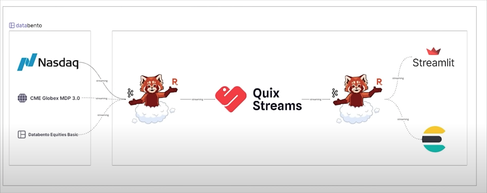

# Realtime Stock Anomaly Detection

This project develops a real-time stock anomaly detection system to identify unusual patterns 
in stock market data. Leveraging Databento as the data source, it processes high-frequency 
market feeds using Kafka for streaming and Quix Streams for real-time data processing. 
Python and scikit-learn (SKlearn) are used to implement machine learning models for anomaly 
detection. The processed data and detected anomalies are indexed and stored in ElasticSearch
for efficient querying and visualization. The entire system is containerized using Docker 
for seamless deployment and scalability.

### Project Architecture

The system follows a modular architecture to ensure real-time processing and scalability:

- Data Ingestion: Databento provides high-frequency market data, ingested via Kafka for reliable streaming.
- Stream Processing: Quix Streams processes incoming data, applying transformations and feeding it to the anomaly detection model.
- Anomaly Detection: SKlearn models analyze streaming data to detect anomalies based on predefined thresholds.
- Storage & Querying: ElasticSearch indexes processed data and anomalies for efficient querying and visualization.
- Deployment: Docker containers encapsulate all components, ensuring portability and consistent environments.

#### Architecture Diagram


### Installation

1. Clone the repository:
   ```bash
   git clone git@github.com:iamYole/realtime-stock-anomaly-detection.git
   ```
2. Install dependencies:
   ```bash
   pip install -r requirements.txt
   ```
3. Set up Docker containers:
   ```bash
   docker-compose up -d
   ```

## Usage
1. Start the Kafka producer to ingest Databento data:
   ```python
   python stockanomalydetectionapp/producer.py
   ```
2. Run the Quix Streams pipeline for real-time processing:
   ```python
   python stockanomalydetectionapp/anomalydetection.py
   ```
3. Query results in ElasticSearch via the provided dashboard URL.


### Code Snippets
#### Kafka Producer (stockanomalydetectionapp/producer.py)
```python
def run(self):

files = glob.glob("nasdaq/*.zst")
files.sort()

        while self.running:

            for file_path in tqdm.tqdm(files):
                print(f"Processing file: {file_path}")

                data = pd.read_csv(file_path)
                # print(data.head())
                # break
                for _, row in data.iterrows():
                    trade = row.to_dict()

                    try:
                        # event = next(trade)
                        json_data = json.dumps(trade)
                        event_serialized = self.serialize(key=trade["symbol"], value=json_data)
                        self.produce(key=event_serialized.key, value=event_serialized.value)
                        # print("Source produced event successfully!")
                    except StopIteration:
                        print("Source finished producing messages.")
                        return
```

#### Anomaly Detection (stockanomalydetectionapp/anomalydetection.py)
```python
def process_trade(raw_trade_data):

    try:
        trade_data = json.loads(raw_trade_data) if isinstance(raw_trade_data, str) else raw_trade_data
    except json.JSONDecodeError:
        print(f"Failed to parse trade data: {raw_trade_data}")
        return

    sequence = trade_data['sequence']

    if sequence in processed_sequence:
        return

    processed_sequence.add(sequence)

    with app.get_producer() as producer:
        anomalies = []

        # 1.  high volume rule
        # 2.  rapid price change
        # 3.  isolation forest anomaly

        if high_volume_rule(trade_data, high_volume_threshold):
            anomalies.append("High Volume")

        if rapid_price_change(trade_data, transaction_history, rapid_price_change_threshold):
            anomalies.append("Rapid Price Change")

        if isolation_forest_anomaly(trade_data, fit_prices_all):
            anomalies.append("Isolation Forest")

        if anomalies:
            trade_data["anomalies"] = anomalies
            print(f"Anomaly detected: {trade_data}")

            #Publish Anomaly to Kafka
            anomaly_data = json.dumps(trade_data)
            producer.produce(
                topic=output_topic.name,
                key=str(trade_data["sequence"]),
                value=anomaly_data
            )
```
#### Rules defination

```python
def high_volume_rule(trade_data, high_volume_threshold):
    return trade_data["size"] > high_volume_threshold[trade_data['symbol']]

def rapid_price_change(trade_data, history, rapid_price_change_threshold):
    symbol = trade_data['symbol']
    current_price = trade_data['price']

    if not history[symbol]:
        history[symbol].append(current_price)
        return False

    last_price = history[symbol][-1]
    price_change = abs((current_price - last_price)/last_price)

    history[symbol].append(current_price)

    return price_change > rapid_price_change_threshold[symbol]

def isolation_forest_anomaly(trade_date, fit_prices):
    global is_fitted
    current_price = trade_date['price']
    fit_prices.append(current_price)

    if len(fit_prices) < 100:
        return False

    fit_price_normalized = (np.array(fit_prices) - np.mean(fit_prices)) / np.std(fit_prices)
    prices_reshaped = fit_price_normalized.reshape(-1, 1)

    if len(fit_prices) % 1000 == 0:
        isolation_forest.fit(prices_reshaped)
        is_fitted = True

    if not is_fitted:
        return False

    current_price_normalized = (current_price - np.mean(fit_prices)) / np.std(fit_prices)
    score = isolation_forest.decision_function(np.array([[current_price_normalized]]))

    return score < 0 #anomalies indicated by negative scores
```


### Screenshots
#### Consumed Data in Kafka


The screenshot above shows a total of 38,064,140 messages streamed from the source data source


The screenshot above shows anomalies detected so far. And these would be sent to Elastic Search or other BI tools
analysis

#### Sample Anomalies


### Dependencies

- Kafka
- Python 3.9+
- Quix Streams
- ElasticSearch
- Docker
- Databento API


### Acknowlegment
This project was inspired by the work of [CodeWithYu](https://www.youtube.com/@CodeWithYu)

### Contributing
Contributions are welcome! Please submit a pull request or open an issue for bugs, features, or improvements.

